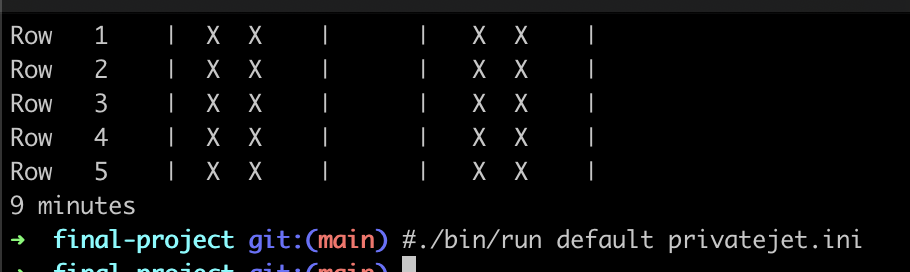
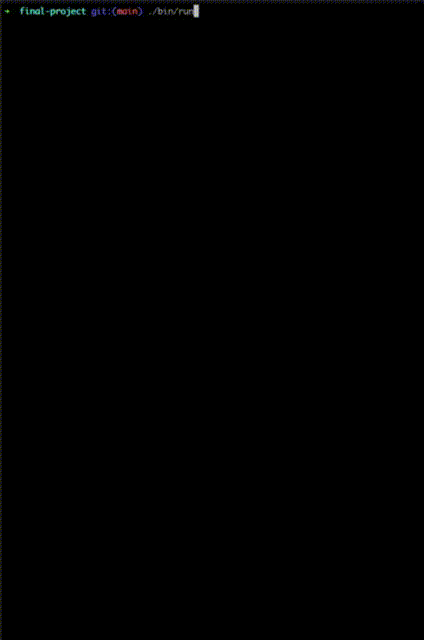

# Boarding Simulation Project

This project is designed to simulate and test various boarding strategies for aircraft. It comprises multiple classes that replicate real-life scenarios encountered during the boarding process.

## Introduction

The project aims to provide insights into efficient boarding strategies by considering factors such as passenger queues, delays caused by bag stows, and the complexities of passengers moving to their assigned seats.

## Assumptions
1. The simulation accounts for passengers waiting in line to board the aircraft by varying the arrival time.
2. It considers delays caused by the process of stowing bags.
3. Delays are simulated when passengers need to wait for others to move to access their window seats.
4. All duration values are configurable in the `config/default.ini` file.

## Features
- Simulation of various boarding strategies
- Ability to write your `Custom Boarding Group` based on ticket delays
- Ability to `modify your aircraft` and test results for your strategies
- Modeling delays due to passengers waiting for seat access
- Customizable duration values for simulation parameters

## How to Run
To execute the simulation:
1. Clone the repository to your local machine.
2. Adjust the duration values in the `config/default.ini` file as required.
3. Run the simulation script to observe the boarding strategies in action.

## Usage

# To view the simulation
```
make run
./bin/run                                 # Default
./bin/run <default/custom> <custom.ini>   # Custom Aircraft size + Boarding Strategy
```

# To run comparison
```
make simulation
./bin/simulation
```

##Images

# Running simulation on a private jet 


# Watch the simulation on a Boeing 737


## References
1. Watch a related video on YouTube [here](https://www.youtube.com/watch?v=oAHbLRjF0vo).
2. Refer to the research paper for further insights [here](https://arxiv.org/pdf/0802.0733.pdf).